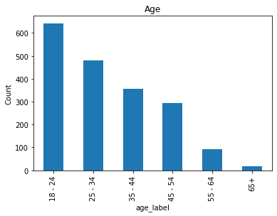
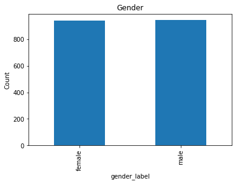
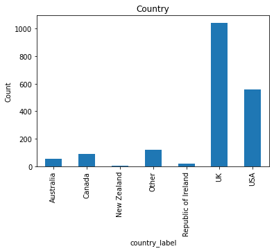
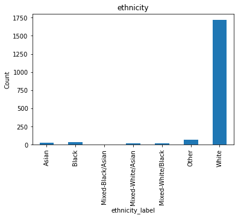

# Fairness and Bias Analysis in Drug Consumption Dataset

This analysis was conducted as a final project for Georgia Tech's AI, Ethics, & Society course (CS6603). The scope of this project was to select a dataset to create a machine learning classification algorithm and analyze both the dataset and algorithm for bias, compute metrics of fairness, and mitigate the biases found. The focus of this project was to identify attributes, outcomes, and biases associated with protected classes.

## Dataset Selected

The dataset selected for this project is the Drug consumption (quantified) dataset from University of California Irvine's archives. This dataset of nearly 2,000 respondents characterizes their personal drug use. In my analysis, responses associated with cannabis and heroin were selected as dependent variables.

### Attributes Associated with Protected Classes

The following attributes were identified to be associated with protected classes:
| Column Name in Dataset | Protected Class |                                               Law |
|-----------------------:|----------------:|--------------------------------------------------:|
|                    age |             age |      Age Discrimination in Employment Act of 1967 |
|                 gender |             sex | Equal Pay Act of 1963; Civil Rights Act of 196... |
|                country | national origin |                    Civil Rights Act of 1964, 1991 |
|              ethnicity |            race |                    Civil Rights Act of 1964, 1991 |

### Dataset Bias Associated with Protected Class Attributes

#### Age

As seen in the histogram above, younger ages (<45) are predominantly represented in this dataset which is a potential source of bias.

#### Gender

As seen in the histogram above, gender is evenly represented in this dataset.

#### Country

As seen in the histogram above, countries represented are predominantly the UK and USA which is a potential bias in this dataset. Extrapolation of findings to other countries would be potentially not accurate.

#### Ethnicity

As seen in the histogram above, by far, the predominantly represented ethnicity is white which is a potential bias in this dataset. Extrapolation of findings to other ethnicities would be potentially not accurate.

## Classification Model

The classification model developed for this dataset is simple. If a respondent answered that they had, at any point in their lives, used cannabis or heroin, they are classified as a user of that drug. 

## Outcomes

Outcomes were determined by the classification model described above. The fairness metrics used were disparate impact and mean difference. The library used to calculate these metrics and also debias the model and dataset was AI Fairness 360. The techniques used to mitigate bais were reweighing and disparate impact remover.

### Heroin Use

#### Age

Most users within this dataset had not at any point in their lives, used heroin across all age groups. The age group with the largest users of heroin are ages 45 - 64.

The disparate impact was 1.019257 and the mean difference was 0.016327, with the privileged group determined to be ages 18 - 44 and the unprivileged group to be age 45 and above. The disparate impact and mean difference indicate that there is a slight bias towards the privileged group. 

When applying reweighing, the disparate impact and mean difference became balanced between the privileged groups. However, there was negligible difference when using the disparate impact remover algorithm.

#### Gender

Most users within this dataset had not at any point in their lives, used heroin across both genders. The gender group with the largest users of heroin were male.

The disparate impact was 1.112887 and the mean difference was 0.090980, with the privileged group determined to be male and the unprivileged group to be female. The disparate impact and mean difference indicate that there is a bias towards the privileged group. 

When applying reweighing, the disparate impact and mean difference became balanced between the privileged groups. However, there was negligible difference when using the disparate impact remover algorithm.

#### Country

Most users within this dataset had not at any point in their lives, used heroin across all countries. The countries with the largest users of heroin was the USA.

The disparate impact was 1.005706 and the mean difference was 0.004856, with the privileged group determined to be from countries Australia, Canada, New Zealand, Republic of Ireland, UK, and USA and the unprivileged group to be Other. The disparate impact and mean difference indicate that there is a slight bias towards the privileged group. 

When applying reweighing, the disparate impact and mean difference became balanced between the privileged groups. However, there was negligible difference when using the disparate impact remover algorithm.

#### Ethnicity

Most users within this dataset had not at any point in their lives, used heroin across all ethnicities. The ethnicity group with the largest users of heroin was white.

The disparate impact was 0.9950889 and the mean difference was -0.004183, with the privileged group determined to be white and the unprivileged group to be Asian, Black, Mized-Black/Asian, Mixed-White/Asian, Mixed-White/Black, and Other. The disparate impact and mean difference indicate that there is a slight bias towards the unprivileged group. 

When applying reweighing, the disparate impact and mean difference became balanced between the privileged groups. However, there was negligible difference when using the disparate impact remover algorithm.

### Cannabis Use

#### Age

The age group with the largest users of cannabis are ages 18 - 44.

The disparate impact was 2.112757 and the mean difference was 0.196369, with the privileged group determined to be ages 18 - 44 and the unprivileged group to be age 45 and above. The disparate impact and mean difference indicate that there is a significant bias towards the privileged group. 

When applying reweighing, the disparate impact and mean difference became balanced between the privileged groups. However, there was negligible difference when using the disparate impact remover algorithm.

#### Gender

The gender group with the largest users of cannabis is female.

The disparate impact was 2.526726 and the mean difference was 0.189424, with the privileged group determined to be male and the unprivileged group to be female. The disparate impact and mean difference indicate that there is a significant bias towards the privileged group. 

When applying reweighing, the disparate impact and mean difference became balanced between the privileged groups. However, there was negligible difference when using the disparate impact remover algorithm.

#### Country

The countries with the largest users of cannabis are the UK and USA.

The disparate impact was 0.448983 and the mean difference was -0.12, with the privileged group determined to be from countries Australia, Canada, New Zealand, Republic of Ireland, UK, and USA and the unprivileged group to be Other. The disparate impact and mean difference indicate that there is a significant bias towards the unprivileged group. 

When applying reweighing, the disparate impact and mean difference became balanced between the privileged groups. However, there was negligible difference when using the disparate impact remover algorithm.

#### Ethnicity

The ethnicity groups with the largest users of cannabis is white.

The disparate impact was 1.683957 and the mean difference was 0.141166, with the privileged group determined to be white and the unprivileged group to be Asian, Black, Mized-Black/Asian, Mixed-White/Asian, Mixed-White/Black, and Other. The disparate impact and mean difference indicate that there is a slight bias towards the privileged group. 

When applying reweighing, the disparate impact and mean difference became balanced between the privileged groups. However, there was negligible difference when using the disparate impact remover algorithm.

## Attempt to Debias for Gender and Heroin Outcome

As an additional step/exercise in mitigating bias, the independent variable of gender and the dependent variable of heroin user were selected. The dataset was split in half. The first dataset was trained without a bias mitigation algorithm. The second was trained after mitigating with the reweighing bias mitigation algorithm.

### Summary

There are differences in the fairness metrics after transforming the dataset, as the disparate impact and mean difference decreased. After training the classifier on the original dataset, the disparate impact and mean difference on the training dataset was greater than the test dataset. After training the classifier on the transformed (bias mitigated) dataset, the disparate impact and mean difference decreased.